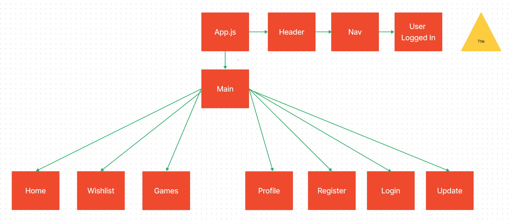

# <Simple-Steam>

## Description
 This project is a Steam clone. We decided to make a wishlist for users to add games from any category to a list after making an account. This project was created to demonstrate our knowledge of PERN Stack(PostgreSQL, Express, React, Node.js) and use of CRUD. 


## Planning
We used figma for our wireframe to design website layout and planned associations and models on a ERD. The project managment was done on Trello Listed below:

[Figma](https://www.figma.com/file/GJcglGgbjQxmLAuQeQYUhN/Component-Heirarchy?node-id=0%3A1&t=3fR5PiBGsENvhGuf-1)


[Trello](https://trello.com/b/uKDXxQbk/simplesteam)


[Component Heirarchy](https://www.figma.com/file/GJcglGgbjQxmLAuQeQYUhN/Component-Heirarchy?node-id=0%3A1&t=3fR5PiBGsENvhGuf-1)


[Models & Associations](https://drive.google.com/file/d/1hKJR3raH_j_YbcrahY0dtTSxKKbwjMqw/view?usp=sharing)


## Workflow 
Our serverside code was deleveloped first in a joint collaboration effort via zoom. From there we developed the UI components independently. Alpagu took on the task of the Search/Nav Bar and wishlist. Faatimah developed the login and register components; Patrick developed the games and landing page; followed by Tyler with the Update profile, title and logged in components. 

## Installation

Initially we created a back-end and front-end(Client) folder. The backend was developed first. The installation includes front-end and back-end libraries and dependencies listed below. More details are on the Trello planner. 

Sequelize:
```
npm init -y
npm i sequelize pg 
(modify config.json dialect to postgres and development_database names)
sequelize db:create
sequelize model:generate -name (Model Name) -attributes (name:string, score:integer, etc..)
sequelize db:migrate
sequelize db:seed:all
npm run dev
```
Client:
```
npm install
npm install react-router-dom
npm install axios
npx create-react-app my-app
```

 
## Usage

A user would go to the login page to create an account. From there, a user could choose games from any category or genre to add to their wishlist as a to buy or play later… 

To add a screenshot, create an `assets/images` folder in your repository and upload your screenshot to it. Then, using the relative filepath, add it to your README using the following syntax:

    ```md
    
    ```

## Collaborators

Faatimah Cleveland [Github](https://github.com/mynameisfaatimah)

Tyler Carter [Github](https://github.com/bojeebs)

Patrick Russo [Github](https://github.com/PatrickRusso)

Alpagu Ilgar Saka [Github](https://github.com/narniaeagle)


## Features
- Users log in and create account
- Select and browse favorite game titles.
- Add/remove titles from wishlist
- Users can add additional wishlists and name them
- Users can search for games via search bar
- Users can update their login information

