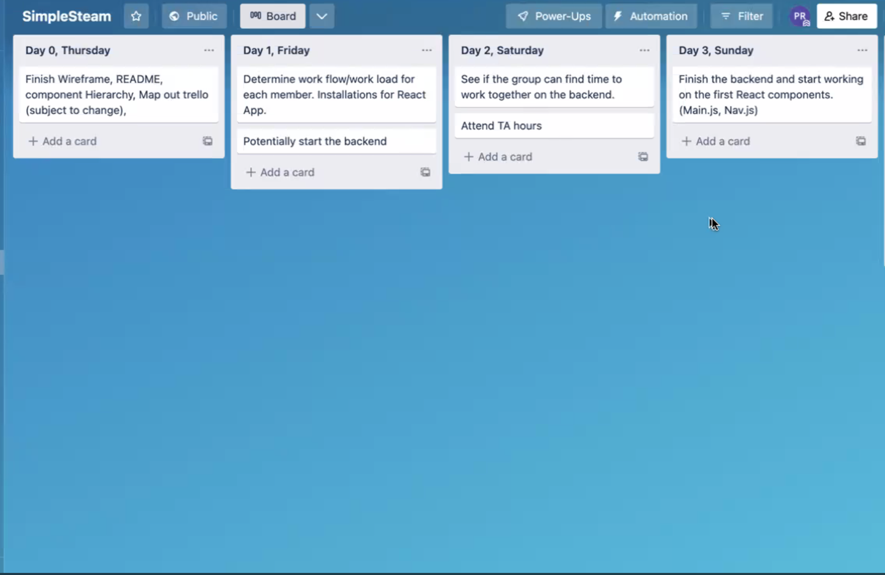

# <Simple-Steam>

## Description
 This project is a Steam clone. We decided to make a straightforward wishlist for users to add games from any genre to a list. This project was created to demonstrate our knowledge of PERN Stack(PostgreSQL, Express, React, Node.js) and use of CRUD. 


## Planning
We used figma for our wireframe to design website layout and planned out associations and models on a ERD. Listed below:

Figma


Trello



Component Heirarchy


ERD of Models and Assoc.


## Installation

Installation includes front-end and back-end libraries and dependencies listed below. More details are on the Trello planner. 

React:
```
npm install
npm install react-router-dom
npm install axios
npx create-react-app my-app
```
Sequelize:
```
npm install
sequelize db:create
sequelize db:migrate
sequelize db:seed:all
npm run dev
```
 
## Usage

A user would go to the login page to create an account. From there, a user could choose games from any category or genre to add to their wishlist as a to buy or play later… 

To add a screenshot, create an `assets/images` folder in your repository and upload your screenshot to it. Then, using the relative filepath, add it to your README using the following syntax:

    ```md
    
    ```

## Credits

Faatimah Cleveland [Github](https://github.com/mynameisfaatimah)

Tyler Carter [Github](https://github.com/bojeebs)

Patrick Russo [Github](https://github.com/PatrickRusso)

Alpagu Ilgar Saka [Github](https://github.com/narniaeagle)


## Features

If your project has a lot of features, list them here.
